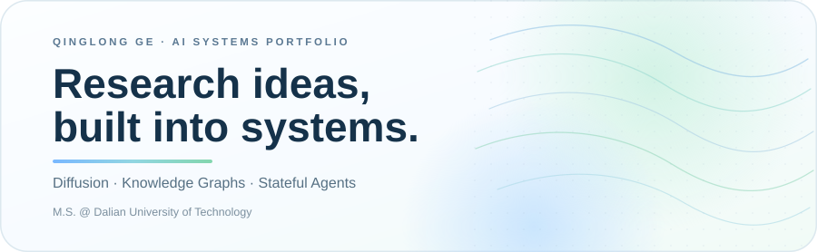
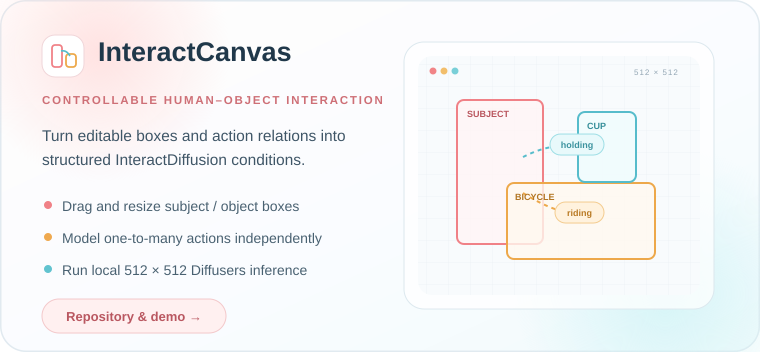
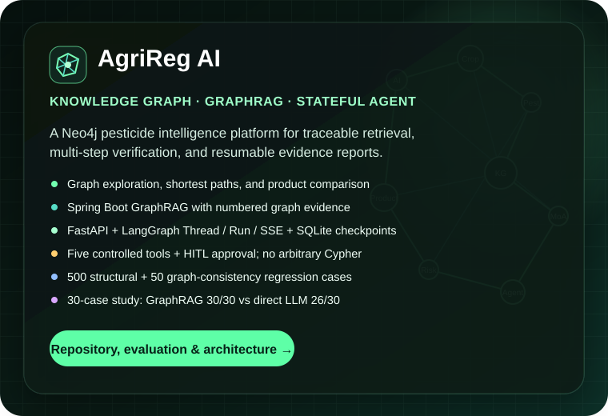
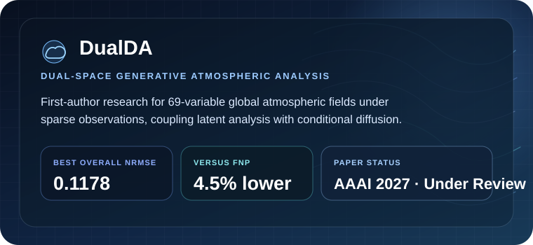

 

  

Building controllable generative models, evidence-grounded graph systems, and stateful AI agents.

## Selected systems

  

  

AgriReg AI's 30-case external comparison is a candidate benchmark. Reproduction requirements and capability boundaries are documented in the repository.

## Research

  

## Engineering focus

| | Area | What I build |
| :--: | --- | --- |
| ◈ | **Generative modeling** | Diffusion models, conditional generation, spatial control, LoRA adapters |
| ⬡ | **Graph intelligence** | Neo4j, Cypher, GraphRAG, grounded answers, retrieval evaluation |
| ⌁ | **Agent systems** | LangGraph, controlled tools, checkpoints, human approval, SSE |
| ◫ | **Backend systems** | FastAPI, Spring Boot, Flask, REST APIs, asynchronous jobs |
| ∿ | **Experimentation** | PyTorch, ablations, reproducible evaluation, P50/P95 analysis |

### Core toolkit

  

<a href="https://github.com/toututuya/InteractCanvas">InteractCanvas</a>
&nbsp;·&nbsp;
<a href="https://github.com/toututuya/Agrireg-AI">AgriReg AI</a>
&nbsp;·&nbsp;
<a href="mailto:qlge816@mail.dlut.edu.cn">Contact</a>

  

<b>Open to AI / LLM application engineering and research-oriented internship opportunities.</b>

